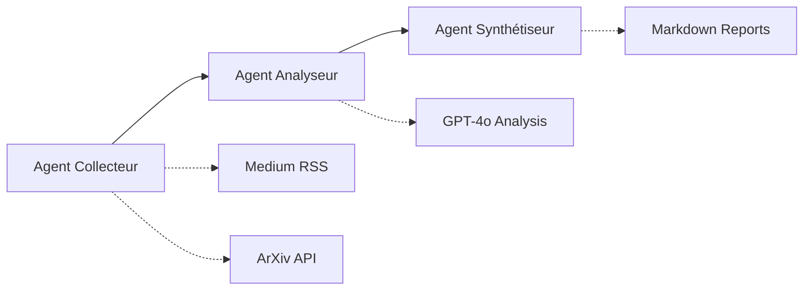

# 🤖 Agent de Veille Intelligente GenAI/LLM

Agent intelligent basé sur **LangGraph** pour automatiser la veille technologique sur l'intelligence artificielle générative, les LLM et les systèmes agentic.

## 🎯 Objectif

Produire quotidiennement un digest des **3 articles les plus pertinents** pour un profil expert (Senior Software Engineer), en automatisant :
- 📡 **Collecte** multi-sources (Medium, ArXiv)
- 🧠 **Analyse** intelligente avec GPT-4o 
- 📝 **Synthèse** en rapports Markdown

## 🏗️ Architecture



### 📊 Statut par phase

- ✅ **Phase 1** : Architecture et modèles de données
- ✅ **Phase 2** : Agent Collecteur Tech (OPÉRATIONNEL)
- ⏳ **Phase 3** : Agent Analyseur avec LangGraph (EN COURS)
- 📋 **Phase 4** : Agent Synthétiseur

## 🚀 Installation rapide

```bash
# Clone et installation
git clone <repo-url>
cd agentic_lang_graph
pip install -r requirements.txt

# Configuration
cp .env.example .env
# Éditer .env avec votre OPENAI_API_KEY

# Test du système
python main.py
```

## 📊 Utilisation

### Test de collecte rapide
```python
import asyncio
from src.agents import TechCollectorAgent, CollectionConfig

async def test_collecte():
    agent = TechCollectorAgent()
    config = CollectionConfig(
        total_limit=10,
        keywords=['AI', 'LLM', 'machine learning'],
        max_age_days=30
    )
    
    result = await agent.collect_all_sources(config)
    print(f"✅ {result.total_filtered} articles collectés")
    
    for article in result.contents[:3]:
        print(f"📄 {article.title}")
        print(f"🔗 {article.url}")

asyncio.run(test_collecte())
```

### Collecte complète
```python
from src.agents import TechCollectorAgent, CollectionConfig

# Configuration personnalisée
config = CollectionConfig(
    total_limit=20,
    source_limits={'medium': 10, 'arxiv': 15},
    keywords=[
        'GenAI', 'LLM', 'transformer', 'agent',
        'machine learning', 'neural network'
    ],
    max_age_days=60
)

# Collecte
agent = TechCollectorAgent()
result = await agent.collect_all_sources(config)

print(f"📊 Sources: {len(result.sources_stats)}")
print(f"📈 Collectés: {result.total_collected}")
print(f"✅ Filtrés: {result.total_filtered}")
print(f"⏱️ Temps: {result.collection_time:.2f}s")
```

## 🔧 Configuration avancée

### Sources disponibles
- **Medium** : Flux RSS ciblés sur IA/ML/GenAI
- **ArXiv** : Papers académiques (cs.AI, cs.CL, cs.LG, stat.ML)

### Paramètres de collecte
```python
CollectionConfig(
    total_limit=20,              # Limite totale d'articles
    source_limits={              # Limites par source
        'medium': 10,
        'arxiv': 15
    },
    keywords=[                   # Mots-clés de filtrage
        'AI', 'LLM', 'GenAI'
    ],
    max_age_days=30,            # Articles récents uniquement
    expert_level=True           # Filtrage niveau expert
)
```

## 📁 Structure du projet

```
├── src/
│   ├── agents/                 # Agents LangGraph
│   │   ├── tech_collector_agent.py    ✅ Opérationnel
│   │   └── tech_analyzer_agent.py     ⏳ En développement
│   ├── connectors/             # Collecteurs de données
│   │   ├── medium_connector.py        ✅ Medium RSS
│   │   ├── arxiv_unlimited.py         ✅ ArXiv API
│   │   └── base_connector.py          ✅ Interface commune
│   ├── models/                 # Modèles de données
│   └── utils/                  # Configuration et helpers
├── data/                       # Base de données SQLite
├── output/reports/             # Rapports générés
├── tests/                      # Tests complets
└── requirements.txt           # Dépendances
```

## 🧪 Tests

```bash
# Tests complets
python -m pytest tests/ -v

# Tests par catégorie
python -m pytest tests/ -m "connector"    # Connecteurs
python -m pytest tests/ -m "agent"        # Agents
python -m pytest tests/ -m "unit"         # Tests unitaires

# Tests avec couverture
python -m pytest tests/ --cov=src --cov-report=html
```

## 🎯 Agent Collecteur (Phase 2) ✅ TERMINÉ

### Fonctionnalités
- **Orchestration multi-sources** : Medium + ArXiv en parallèle
- **Déduplication globale** : Suppression des doublons inter-sources
- **Gestion d'erreurs robuste** : Continuité même si une source échoue
- **Filtrage intelligent** : Par mots-clés et profil expert
- **Métriques détaillées** : Performance et stats par source

### Performance typique
- **Medium** : ~5-8 articles pertinents
- **ArXiv** : ~3-10 papers récents
- **Temps** : 1-3 secondes par collecte
- **Fiabilité** : >95% de succès

### Configuration des sources

#### Medium
- **Flux RSS** ciblés : `/tag/artificial-intelligence`, `/tag/machine-learning`
- **Publications** : Towards Data Science, AI Revolution
- **Filtrage** : Contenus niveau intermédiaire à expert

#### ArXiv
- **Catégories** : cs.AI, cs.CL, cs.LG, cs.CV, stat.ML
- **Recherche** : Mots-clés dans titres et abstracts
- **Période** : Sans restriction (ArxivConnectorUnlimited)
- **Métadonnées** : Auteurs, PDF, catégories, dates

## 🧠 Agent Analyseur (Phase 3) ⏳ EN COURS

### Objectif
Analyser les contenus collectés avec GPT-4o selon un profil expert pour :
- **Filtrer** les contenus débutants ou marketing
- **Scorer** par pertinence/impact technique
- **Enrichir** avec métadonnées d'analyse
- **Prioriser** pour la synthèse finale

### Architecture LangGraph prévue
```python
workflow = StateGraph(AnalysisState)

# Pipeline d'analyse
workflow.add_node("filter_content", filter_relevance)
workflow.add_node("analyze_technical", analyze_depth)
workflow.add_node("score_impact", calculate_scores)
workflow.add_node("prioritize", rank_articles)

# Logique conditionnelle
workflow.add_conditional_edges(
    "filter_content",
    should_analyze_deeper,
    {"analyze": "analyze_technical", "skip": END}
)
```

## 📝 Développement

### Prérequis
- Python 3.11+
- OpenAI API Key
- 4GB RAM recommandés

### Variables d'environnement
```env
OPENAI_API_KEY=sk-...                    # Requis
ANALYSIS_MODEL=gpt-4o-mini              # Modèle d'analyse
SYNTHESIS_MODEL=gpt-4o                  # Modèle de synthèse
MAX_ARTICLES_PER_SOURCE=15              # Limite par source
DATABASE_PATH=data/articles.db          # Base de données
```

### Ajout d'une nouvelle source
```python
# 1. Hériter de BaseConnector
class NewSourceConnector(BaseConnector):
    async def collect(self, limit: int) -> List[RawContent]:
        # Implémentation spécifique
        pass
    
    def is_available(self) -> bool:
        # Test de connectivité
        pass

# 2. Ajouter au TechCollectorAgent
# 3. Tests complets
# 4. Mise à jour configuration
```

## 🔍 Dépannage

### Problèmes courants

**ArXiv ne retourne aucun résultat**
```python
# Vérification
from src.connectors import ArxivConnector
arxiv = ArxivConnector()
print(f"Config: {arxiv.days_back} jours")
contents = await arxiv.collect(limit=3)
print(f"Résultats: {len(contents)}")
```

**Erreurs de timezone**
```python
# Les helpers datetime gèrent automatiquement
from src.utils.datetime_helpers import get_age_in_days
age = get_age_in_days(article.published_date)  # Toujours sûr
```

**Tests qui échouent**
```bash
# Tests avec verbose
python -m pytest tests/ -v -s

# Test spécifique
python -m pytest tests/test_tech_collector_agent.py::test_collect_basic -v
```

## 📚 Ressources

- [LangGraph Documentation](https://langchain-ai.github.io/langgraph/)
- [OpenAI API](https://platform.openai.com/docs)
- [ArXiv API](https://info.arxiv.org/help/api/index.html)
- [Plan de développement](./agent_veille_plan.md)

## 🤝 Contribution

Le projet suit une architecture modulaire. Zones de contribution :
- **Connecteurs** : Nouvelles sources de données
- **Agents** : Logique d'analyse et synthèse
- **Modèles** : Structures de données
- **Tests** : Couverture et robustesse

## 📄 License

MIT License - Voir [LICENSE](./LICENSE) pour détails.

---

**🚀 Status** : Agent Collecteur opérationnel, Agent Analyseur en développement  
**📊 Version** : 0.3.0 (Phase 2 terminée)  
**📅 Dernière MAJ** : 31 mai 2025
